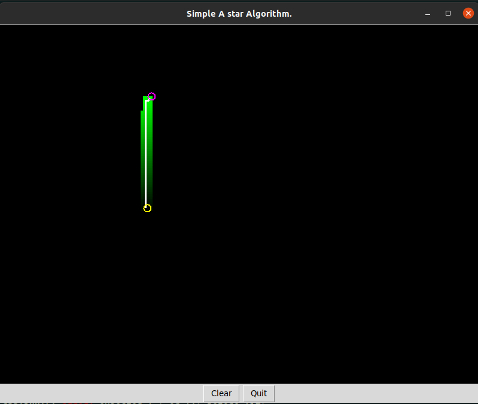
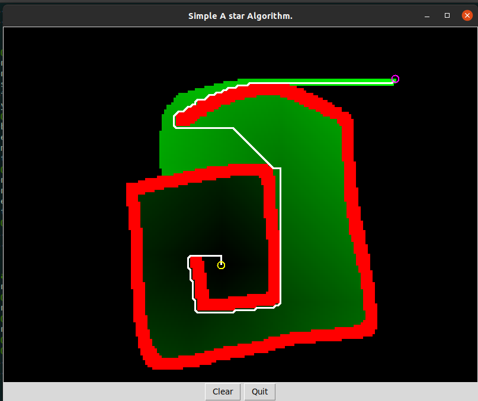
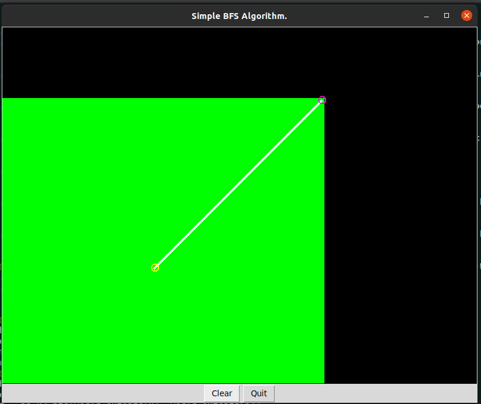
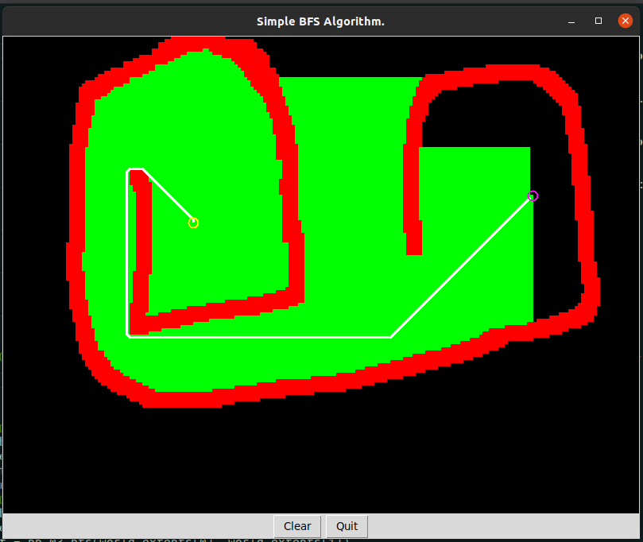
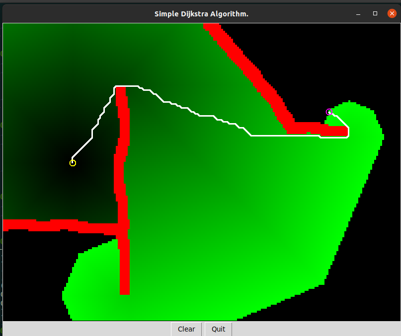
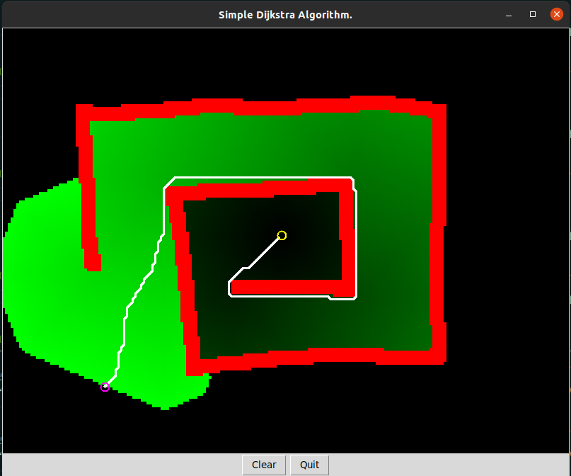

# Path-Planners-Interactive-GUI (CPP Python bridge)

###  Classical Robotics Path Planners written from scratch, visualized in interactive GUI - capable of adding obstacles, start-end points and visualizing visited and potential nodes.
* This repository features 3 main path planning algorithms which are written in C++, working as a backend for the GUI written in python.
* C++ algorithms and C++ <-> python bridge (via boost python) is self written.
* The credit for GUI goes to Dr. Claus Brenner.

## A* Algorithm
| Simple obstacle free path | Obstacle path | 
|:-------:|:-----------------:|
|   | |

## BFS Algorithm
| Simple obstacle free path | Obstacle path | 
|:-------:|:-----------------:|
|   | |

## BFS Algorithm
| Simple obstacle path | Complex Obstacle path | 
|:-------:|:-----------------:|
|   | |
